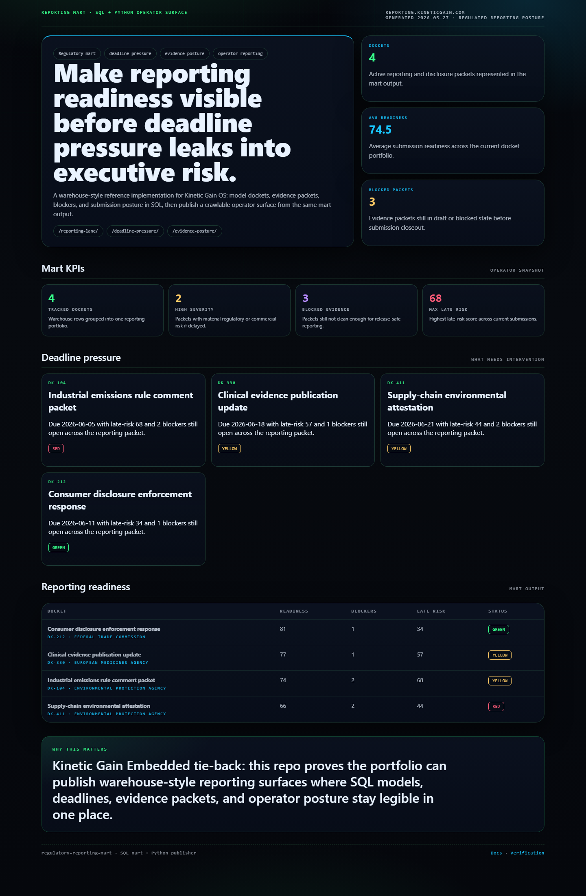
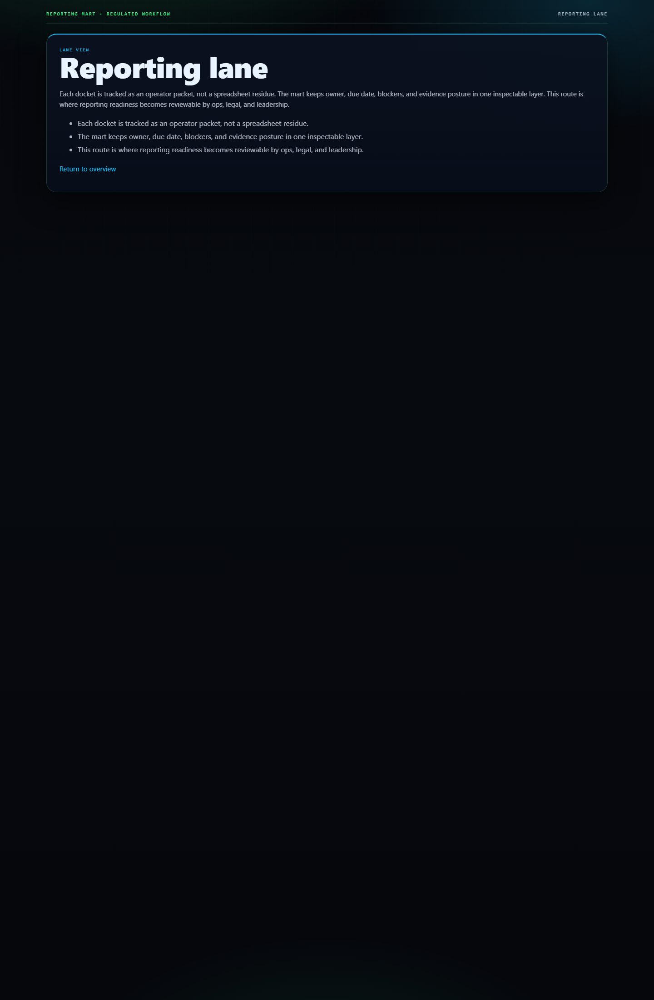

# regulatory-reporting-mart

Warehouse-style reporting mart for docket readiness, evidence packets, and deadline pressure.

## What it shows

- executable SQL schema, seed data, and mart views for regulated reporting workflows
- a local-first mart that turns dockets, packets, blockers, and late-risk into operator-readable outputs
- a static custom-domain surface published from the same mart results

## Routes

- `/`
- `/reporting-lane/`
- `/deadline-pressure/`
- `/evidence-posture/`
- `/verification/`
- `/docs/`

## Local development

```powershell
python scripts\run_demo.py
python scripts\generate_site.py
```

## Validation

```powershell
python -m pytest
python scripts\smoke_check.py
```

## Screenshots





## Why this matters

Kinetic Gain Embedded tie-back:

This repo proves Kinetic Gain can ship warehouse-style operator reporting, not only app shells. SQL models, blocker counts, deadline pressure, and evidence posture stay visible in one mart-driven surface that buyers and recruiters can actually inspect.
